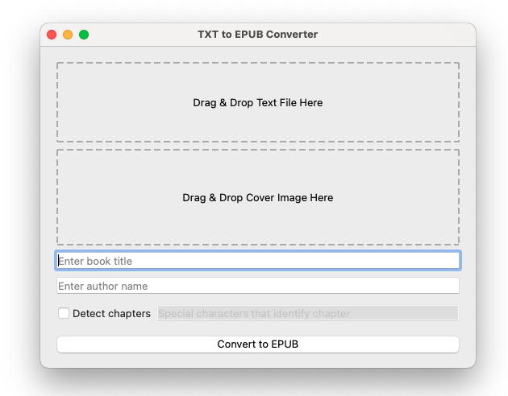

# Text2Epub-Converter


This is a simple GUI application that converts text files into EPUB format. It's built with PyQt5 and ebooklib.

## Features

- Drag and drop interface for text files and cover images
- Create Epub with metadata (book title and author name)
- Support detect chapters based on special characters

## Installation

1. Clone the repository

```bash
git clone https://github.com/yourusername/Text2Epub-Converter.git
```

2. Navigate to the project directory:

```bash
cd Text2Epub-Converter
```

3. Install the required packages:

```bash
pip install -r requirements.txt
```

## Usage

```bash
python main.py
```

Drag and drop your text file and cover image into the designated areas. Enter the book title and author name. If your text file has chapters, check the "Detect chapters" box and enter the special characters that identify a chapter. Click "Convert to EPUB" to create your EPUB file.

